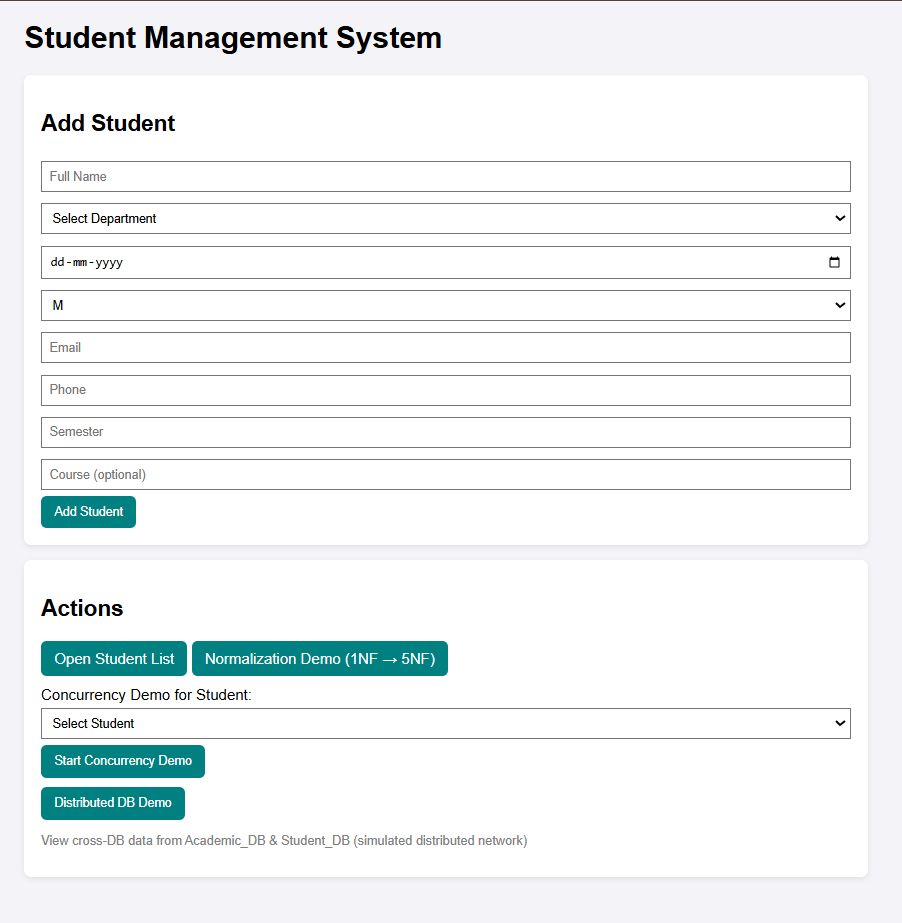
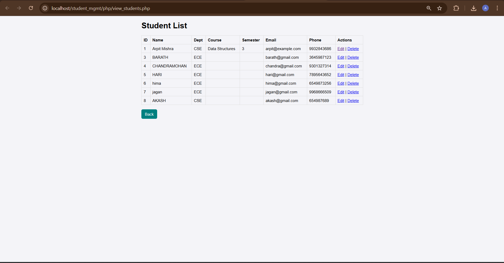
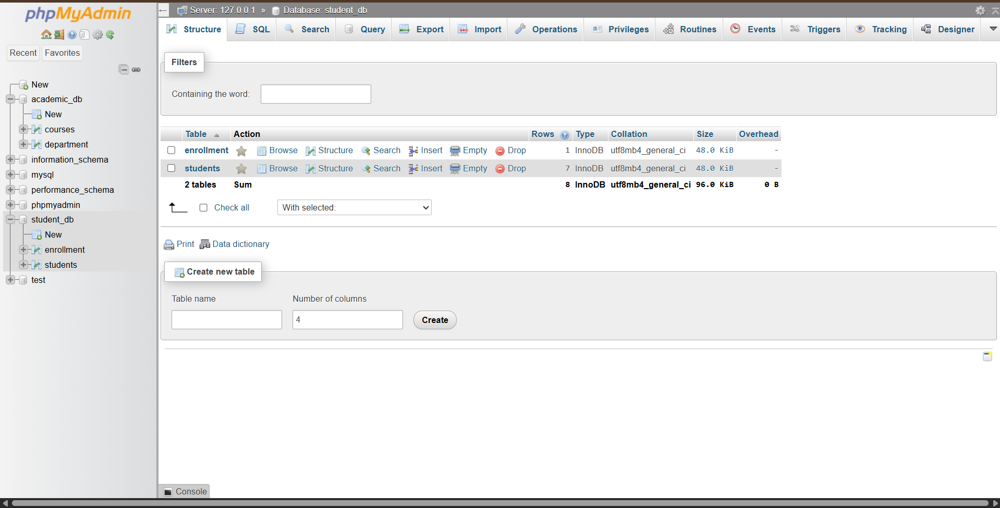
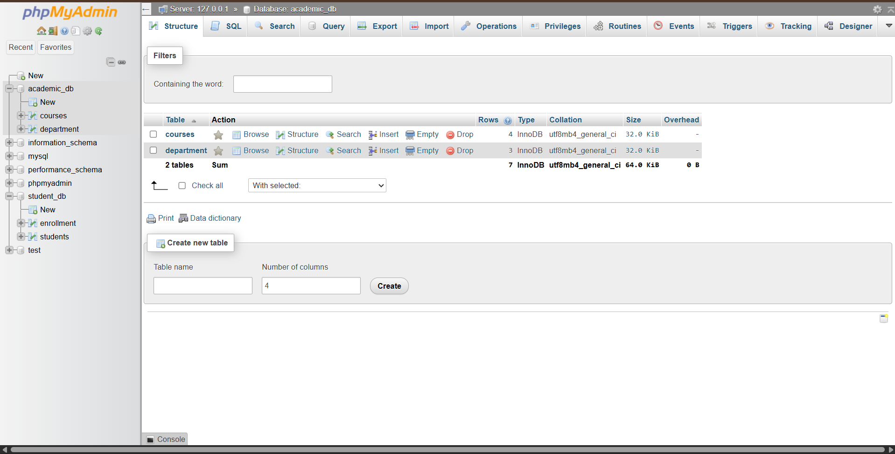

# 🎓 Student Management System

A structured and interactive **Student Management System** developed using **PHP, MySQL, and XAMPP**, designed to demonstrate both practical database operations and advanced DBMS concepts such as normalization, concurrency, and distributed database simulation.

---

## 📖 Project Overview

This system allows administrators to manage student records efficiently while also showcasing important database management concepts in action.

The application is divided into two major sections:

1. Student Registration Module
2. Advanced Database Demonstration Module

---

## 🧾 1️⃣ Add Student Module

The system provides a structured form to add new students with the following details:

- Full Name
- Department Selection
- Date of Birth
- Gender
- Email
- Phone Number
- Semester
- Course (Optional)

Once submitted, the student data is stored securely in the MySQL database.

This module ensures:
- Clean form handling
- Organized data storage
- Department-based classification
- Academic linking support

---

## ⚙️ 2️⃣ Action Panel (Advanced Database Concepts)

The system includes a dedicated action panel to demonstrate key DBMS principles:

### 📋 Open Student List
Displays all stored students with structured database retrieval.

### 🔄 Normalization Demo (1NF → 5NF)
Demonstrates database normalization stages:
- Removal of redundancy
- Proper table structuring
- Functional dependency handling
- Schema optimization

### 🔐 Concurrency Demo
Simulates concurrent access to a student record to demonstrate:
- Data consistency
- Transaction handling
- Multi-user interaction logic

### 🌐 Distributed DB Demo
Simulates cross-database data retrieval between:

- `student_db`
- `academic_db`

This demonstrates distributed database architecture and cross-database querying.

---

## 🗄️ Database Architecture

The project uses two databases:

1. student_db
   - students
   - enrollment

2. academic_db
   - courses
   - department

This separation simulates a distributed academic system.

SQL files included:
- student_db.sql
- academic_db.sql

---

## 🛠️ Technologies Used

- PHP (Backend Logic)
- MySQL (Database)
- phpMyAdmin
- XAMPP
- HTML & CSS

---

## ▶️ How to Run Locally

1. Install XAMPP
2. Copy the project folder into:
   C:\xampp\htdocs\
3. Start Apache and MySQL
4. Open phpMyAdmin
5. Import:
   - student_db.sql
   - academic_db.sql
6. Run in browser:
   http://localhost/student_mgmt/public/index.php

---

## 🎯 Learning Outcomes

This project demonstrates:

- Practical CRUD operations
- Database normalization (1NF to 5NF)
- Concurrency simulation
- Distributed database concept
- Cross-database data access
- Structured academic data modeling

---

## 📌 Project Purpose

This system was built for academic learning and demonstration of DBMS concepts along with real-time student data management functionality.

---
---

## 📸 Screenshots

### 🏠 Main Page

### 📋 Student List

### 🗄️ Student Database

### 🏫 Academic Database

### 🧾 Academic Courses Table
.png)

### 🏢 Academic Department Table
.png)

### ⚙️ XAMPP Control Panel

### 🔄 Normalization (2NF, 3NF)
.png)

### 🔄 Normalization (4NF, 5NF)
.png)

### 🔁 Concurrency Demo
.png)

### 📊 Student Table
.png)

---

## 🧠 Concepts Demonstrated

- Database Design
- Data Normalization
- Relational Database Management
- Backend Development using PHP
- CRUD Application Architecture
- Multi-Database Handling
- Concurrency Control Basics

---

## 🚀 Future Improvements

- Add login authentication system
- Role-based access (Admin / Staff)
- Search and filter functionality
- Export student data to PDF
- Deploy on live server

---

## 👨‍💻 Developed By

ARPIT MISHRA S
